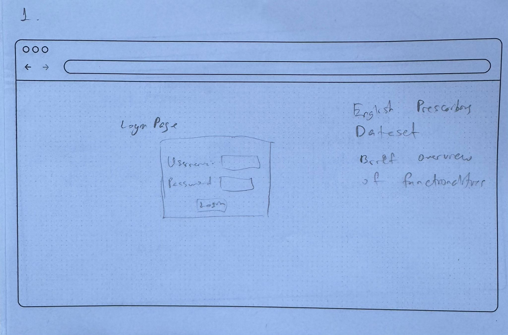
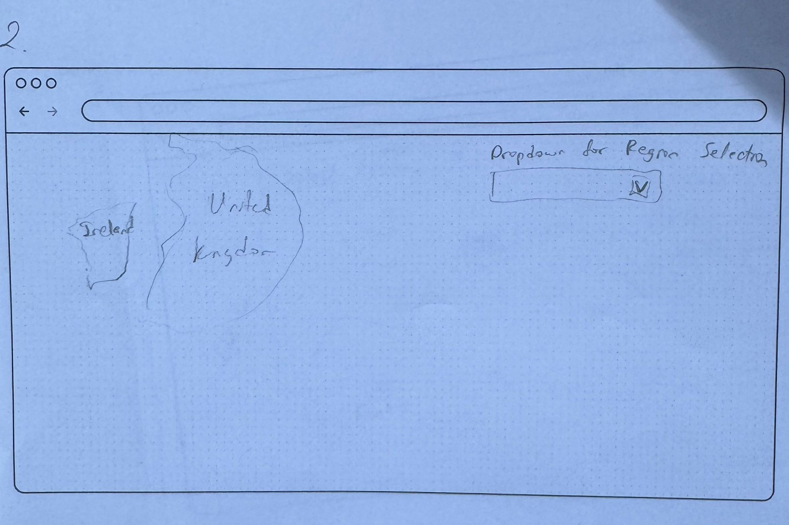
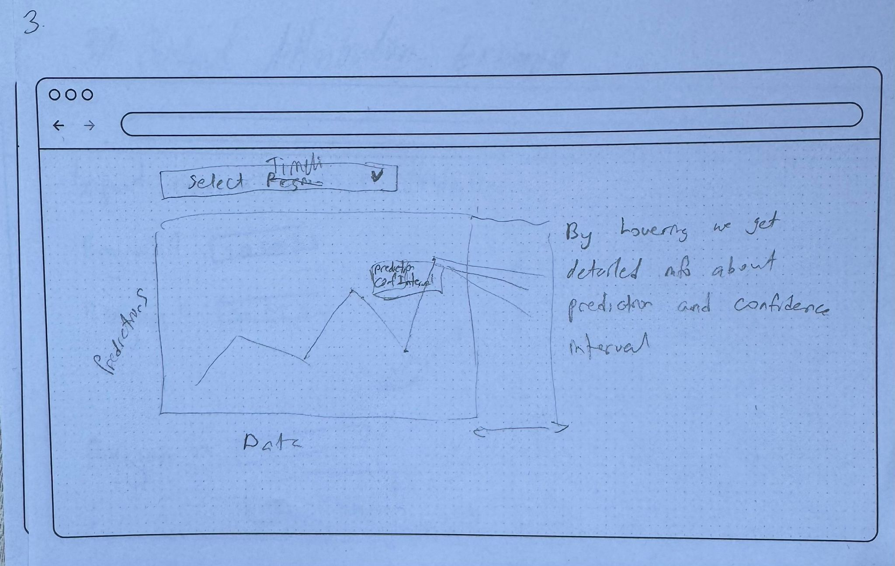
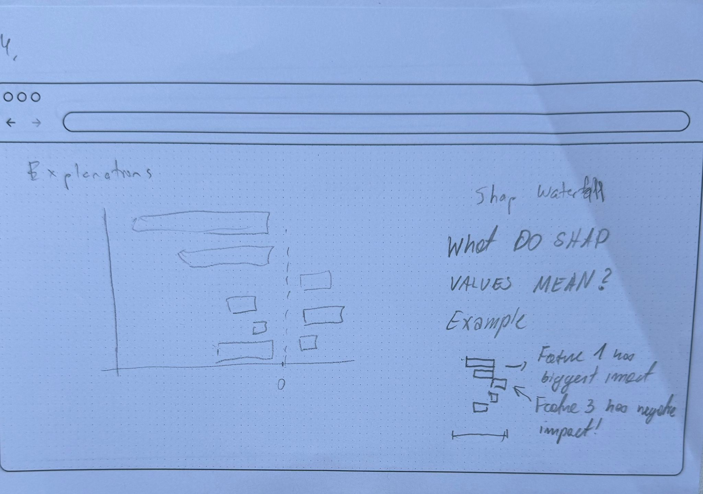
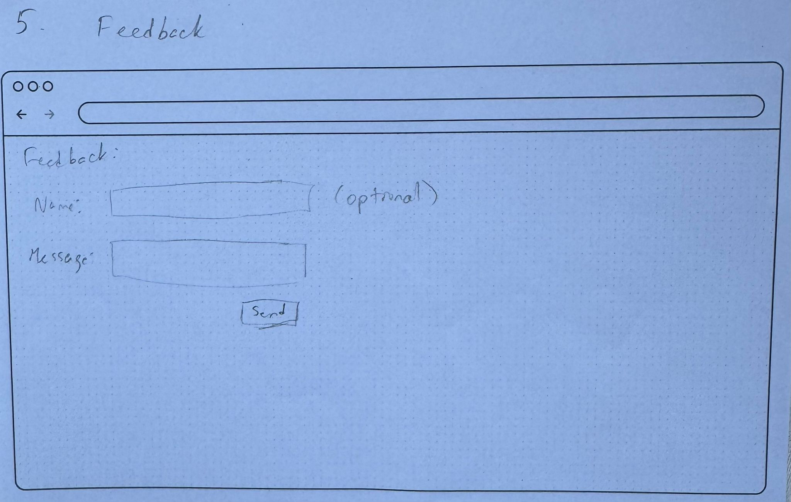

# HCDS-EPD

## Data overview 
The English Prescribing Dataset (EPD) is a comprehensive resource detailing prescriptions issued by general practices in England and dispensed across the UK and Crown Dependencies. It is compiled and published monthly by the NHS Business Services Authority (NHSBSA) via the Open Data Portal and updated montly, the last update dates back to March 2025, the first records date back to January 2014.

For accessing the data, please visit : https://opendata.nhsbsa.net/dataset/english-prescribing-data-epd. Importantly no prior training needs to be done to gain access.

## Data Source and Collection:

The dataset is compiled from multiple NHSBSA data sources to ensure accuracy and consistency in prescription records. It is part of the Community prescribtion and dispensing datasets: https://opendata.nhsbsa.net/theme/about/community_prescribing_dispensing

## Licensing:

The EPD is released under the Open Government Licence 3.0 (United Kingdom), permitting free use, modification, and distribution of the data, however with propper attribution.

## Dataset Background & Fairness Considerations 

### When was the dataset created?

The dataset was first published in January 2014, and it has been updated monthly since.

### Preprocessing

1. Aggregation at the GP Practice/Cost Centre and item level
2. Standardization using British National Formulary (BNF) codes.
3. Calculation of: 
   - Total items 
     - the total number of times that the medicine, dressing or appliance
appeared on prescription forms that were prescribed and dispensed

   - Quantity and total quantity (Quantity × Total Items)

   - Net Ingredient Cost (NIC based on the Drug Tariff and manufacturer price)

   - Actual Cost (NIC minus average discounts + dispensing fees + rounding)

   - Average Daily Quantity (ADQ standardized to adult usage)

4. Exclusion of certain prescriptions (e.g., those from prisons, PGD-supplied, or not submitted to NHS Prescription Services).

### What are the protected attributes? 

1. Geographic region (STP, CCG, postal code) are protected to ensure that regional disparities are not disrupting the equal access or funding.
2. Type of medication prescribed (e.g., mental health related drugs, addiction) to ensure that community-level bias are avoided.
3. Practice name - not inherently protected, but might be used as a proxy to identify geographic and socioeconomic clusters.

***
#### Documentation for EDP can be viewed in the following link:
https://opendata.nhsbsa.net/dataset/english-prescribing-data-epd

## Decision-Making Scenario

Government spending on prescription medicine is hard to predict and allocate. There are drug epidemics sweeping England every year, and there can also be malpractice in individual hospitals. All these factors make the job of allocating funds for prescription medication in particula regions very hard.  
We propose a ML-based decision making solution, that will forecast the cost of prescribed medication in a geographical area, for the next time period. The ML model will be able to catch certain patterns and trends in the data, and provide reliable predictions, which can serve as a basis for decision making.  
The system will produce predictions which will be saved and presented in a webpage UI, along with the explanations behind the decisions. This webpage will be accessible by policy makers and government officials tasked with allocating funds. The officials will be able to base their decisions on robust forecasts, and not just their gut feeling. 
The particular ML task for this tool is spatio-temporal forecasting (regression), but the system could also aid with clustering data analysis, anomaly detection, etc.  
It is very important not to endager any specific hospital or part of the population with the outcomes of using such a solution. The protected attributes (individual hospitals, geographical information) should be left out of the equation, and the resulting system should be robust and provide enough coverage.

## Stakeholder Analysis

1. **NHSBSA Administrators**

**Stakeholder Knowledge**:
* High understanding of healthcare regulations. Familiar with data collection and validation processes for the EPD. Familiarity with EPD structure, data fields (e.g., costs, quantities), and update schedules.

**Goals**:

* Ensure accurate and secure management of prescribing data.

**Objectives**:
* Maintain data integrity and compliance.

**Tasks**:
* Check  data uploads and updates of data.
* Validate data quality and resolve discrepancies..

**Key Questions**:
* How does the platform ensure data security and compliance with GDPR?
* How quickly can we generate reports for specific medications?

2. **Healthcare Researchers**

**Stakeholder Knowledge**:

* Expert knowledge in healthcare policy. 

**Goals** :

* Produce high-impact research on prescribing patterns and healthcare outcomes.
* Identify trends to inform clinical guidelines and policy.

**Objectives**:

**Tasks**:

* Perform statistical analysis on prescription volumes and costs.
* Visualize regional variations for publications.

**Key Questions**:

* How does the platform handle missing or incomplete data?

3. **Public Health Officials**

**Stakeholder Knowledge**:

* Domain Expertise: Expert in public health policy. Knowledge in data analysis for regional analysis. 

**Goals** :

* Monitor and reduce public health risks.
* Inform national health policies with prescribing insights.

**Objectives**:

* Track prescribing trends for high risk medicatiions .
* Analyze regional disparities in healthcare.

**Tasks**:

* Generate reports on antibiotic prescribing rates across England.
* Map prescription volumes by region for resource allocation.

**Key Questions**:

* How does it support geographic analysis of prescribing patterns?
* 

## Group Paper Prototypes
**Individual Paper Prototypes**

**Final**

## Scenario Walkthrough

* The stakeholder interacts with website. The entry point is login page or an informative landing page that presents overview of national and regional prescription spending. 
* The decision supported is presented via interactive visualization that supports filtering by region and time window and optional insights such as anomalies or high volatility zones The information presented focuses on Geographical and temporal divisions of the data. It should give the stakeholders clear image of monthly forecasted cost per region, confidence intervals and anomaly alerts. 
* Forecasting uncertainty is communicated through shaded confidence intervals on time-series plots. Where uncertainty exceeds a defined threshold, a warning icon is displayed with a tooltip explaining the risk of over or under-allocation.
* Using SHAP values, confidence intervals, or low-confidence warnings, the system provides interpretable explanations by showing which features most contributed to a prediction — e.g., previous cost spikes, seasonal flu, etc. Simple tooltips or expandable panels show why a region is forecasted to increase, using natural language. Public health officials have access to full details, including region-level data and confidence intervals. However, as they might also be non-technical users, the system summarizes predictions using color-coded indicators and simple explanations.
* To ensure that system remains responsive to stakeholder needs, a feedback form is als integrated into the user interface. NHS administrators, healthcare researchers, and public health officials—are encouraged to share suggestions for improvement or further requirements.

## Prototypes from exercise session

## User Interview
In order to validate our prototype before finalizing it, we have compiled an interview guide, and would interview potential users.
You can find the interview guide at the following URL: https://docs.google.com/document/d/1ddFtsiFzEY1weKoCA326Nb-O7l8S8Wm_FCaIgB1jr9E/edit?tab=t.mslw7ytt53ot